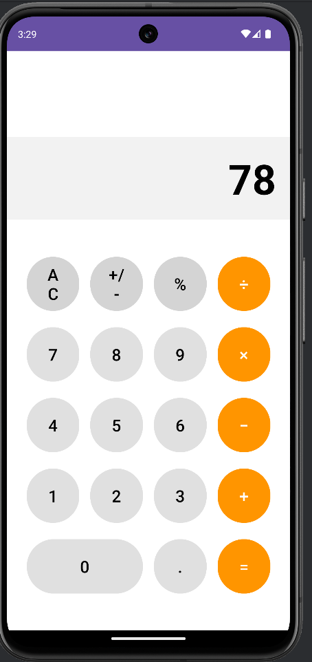

# 🧮 Hesap Makinesi

Android platformu için Kotlin ile geliştirilmiş, modern ve kullanıcı dostu hesap makinesi uygulaması.

## 📱 Ekran Görüntüleri


## ✨ Özellikler

### Temel İşlemler
- ➕ **Toplama:** İki veya daha fazla sayıyı toplama
- ➖ **Çıkarma:** Sayılar arasında çıkarma işlemi
- ✖️ **Çarpma:** Çarpma işlemleri
- ➗ **Bölme:** Bölme işlemleri (Sıfıra bölme kontrolü)

### Ek Özellikler
- 🔢 **Ondalıklı Sayı:** Virgül/nokta desteği
- 🧹 **Temizle (C):** Tüm girişleri sıfırlama
- ⌫ **Geri Al (DEL):** Son rakamı silme
- ➕➖ **İşaret Değiştir:** Pozitif/negatif dönüşüm
- 🎨 **Modern UI:** Material Design ile şık arayüz
- 📱 **Responsive Tasarım:** Farklı ekran boyutlarına uyum

## 🛠️ Kullanılan Teknolojiler

- **Dil:** Kotlin
- **IDE:** Android Studio
- **Min SDK:** API 21 (Android 5.0 Lollipop)
- **Target SDK:** API 34 (Android 14)
- **UI Components:**
  - ConstraintLayout (Esnek düzen)
  - TextView (Sonuç gösterimi)
  - Button (Sayı ve işlem butonları)
  - Material Design Components

## 📋 Gereksinimler

- Android Studio Hedgehog | 2023.1.1 veya üzeri
- JDK 17 veya üzeri
- Android SDK
- Kotlin 1.9.0 veya üzeri
- Gradle 8.0 veya üzeri

## 🚀 Kurulum

1. **Projeyi Klonlayın:**
```bash
git clone https://github.com/Sercansen21/mobil-uygulama-gelistirme.git
cd mobil-uygulama-gelistirme/hesap-makinesi
```

2. **Android Studio'da Açın:**
   - Android Studio'yu başlatın
   - `File > Open` menüsünden proje klasörünü seçin
   - Gradle sync işleminin tamamlanmasını bekleyin

3. **Bağımlılıkları Yükleyin:**
   - Gradle otomatik olarak gerekli bağımlılıkları indirecektir
   - `build.gradle` dosyalarını kontrol edin

4. **Uygulamayı Çalıştırın:**
   - Android emülatör başlatın veya fiziksel cihaz bağlayın
   - `Run > Run 'app'` veya `Shift + F10`

## 💻 Kod Yapısı

### MainActivity.kt
Ana hesap makinesi mantığını içerir:
```kotlin
class MainActivity : AppCompatActivity() {
    private var firstNumber = ""
    private var operator = ""
    private var secondNumber = ""
    
    // Buton click işlemleri
    // Hesaplama fonksiyonları
    // Sonuç gösterimi
}
```

### Temel Fonksiyonlar
- `onNumberClick()`: Sayı butonlarına tıklama
- `onOperatorClick()`: İşlem butonlarına tıklama
- `calculate()`: Hesaplama işlemi
- `clearAll()`: Tüm değerleri sıfırlama
- `deleteLastDigit()`: Son rakamı silme

## 📝 Kullanım

### Basit İşlem
1. İlk sayıyı girin (örn: 25)
2. İşlem butonuna tıklayın (örn: +)
3. İkinci sayıyı girin (örn: 15)
4. "=" butonuna basın
5. Sonuç: 40

### Zincirleme İşlem
1. İlk sayıyı girin (örn: 10)
2. İşlem seçin (örn: ×)
3. İkinci sayıyı girin (örn: 5)
4. "=" basın → Sonuç: 50
5. Yeni işlem seçin (örn: +)
6. Yeni sayı girin (örn: 20)
7. "=" basın → Sonuç: 70

### Ondalıklı Sayılar
- "." butonuna basarak ondalıklı sayı girebilirsiniz
- Örnek: 3.14 + 2.86 = 6.00

## 🎨 UI Tasarımı

### Layout Yapısı
```
ConstraintLayout
├── TextView (Sonuç Ekranı)
├── GridLayout (Butonlar)
│   ├── Number Buttons (0-9)
│   ├── Operator Buttons (+, -, ×, ÷)
│   ├── Special Buttons (C, DEL, =, .)
│   └── Additional Buttons (%, ±)
```

### Renk Paleti
- **Primary Color:** Material Blue
- **Operator Buttons:** Orange
- **Number Buttons:** Light Gray
- **Result Display:** Dark Background

## 📁 Proje Yapısı

```
hesap-makinesi/
│
├── app/
│   ├── src/
│   │   ├── main/
│   │   │   ├── java/com/example/hesapmakinesi/
│   │   │   │   ├── MainActivity.kt
│   │   │   │   └── CalculatorUtils.kt (Helper functions)
│   │   │   ├── res/
│   │   │   │   ├── layout/
│   │   │   │   │   └── activity_main.xml
│   │   │   │   ├── values/
│   │   │   │   │   ├── strings.xml
│   │   │   │   │   ├── colors.xml
│   │   │   │   │   ├── themes.xml
│   │   │   │   │   └── dimens.xml
│   │   │   │   └── drawable/
│   │   │   │       ├── button_number.xml
│   │   │   │       ├── button_operator.xml
│   │   │   │       └── button_equals.xml
│   │   │   └── AndroidManifest.xml
│   │   └── test/
│   └── build.gradle
├── gradle/
├── build.gradle
└── README.md
```

## 🎓 Öğrenilen Konular

- **Kotlin Temelleri:** Variables, functions, conditionals
- **Event Handling:** Button click listeners, onClickListener
- **String Manipülasyon:** Sayı işleme, format dönüşümleri
- **UI Tasarımı:** ConstraintLayout, Material Design
- **Matematiksel İşlemler:** Hesaplama mantığı
- **Exception Handling:** Hata kontrolü (örn: sıfıra bölme)
- **State Management:** Uygulama durumu yönetimi

## 🐛 Bilinen Sorunlar

- Çok uzun sayılarda ekran taşması (gelecek güncellemede düzeltilecek)

## ⚠️ Kısıtlamalar

- Maksimum 15 haneli sayı girişi
- Bilimsel hesaplama fonksiyonları yok (sin, cos, log vb.)
- Hafıza fonksiyonları (M+, M-, MR) şu anda mevcut değil

## 🔜 Gelecek Özellikler

- [ ] Bilimsel hesaplama modu
- [ ] Geçmiş işlem kaydı
- [ ] Tema değiştirme (Dark/Light mode)
- [ ] Hafıza fonksiyonları (M+, M-, MC, MR)
- [ ] Yüzde hesaplama iyileştirmesi
- [ ] Kare ve karekök işlemleri
- [ ] Üs alma işlemi
- [ ] Parantez desteği

## 🧪 Test Senaryoları

### Temel İşlemler
- ✅ 5 + 3 = 8
- ✅ 10 - 4 = 6
- ✅ 7 × 6 = 42
- ✅ 20 ÷ 4 = 5

### Özel Durumlar
- ✅ 10 ÷ 0 = Error
- ✅ 0.1 + 0.2 = 0.3
- ✅ -5 + 3 = -2
- ✅ Clear fonksiyonu çalışması

## 🤝 Katkıda Bulunma

1. Bu repository'yi fork edin
2. Feature branch oluşturun (`git checkout -b feature/YeniOzellik`)
3. Değişikliklerinizi commit edin (`git commit -m 'Yeni özellik eklendi'`)
4. Branch'inizi push edin (`git push origin feature/YeniOzellik`)
5. Pull Request oluşturun

## 📄 Lisans

Bu proje [MIT](https://choosealicense.com/licenses/mit/) lisansı altında lisanslanmıştır.

## 👤 Geliştirici

**Sercan Şen**
- GitHub: [@Sercansen21](https://github.com/Sercansen21)
- Email: sen.sercan.21@email.com

## 📞 İletişim

Sorularınız, önerileriniz veya hata bildirimleri için benimle iletişime geçebilirsiniz.

---

⭐ Bu projeyi beğendiyseniz yıldız vermeyi unutmayın!

💡 **İpucu:** Bilimsel hesaplama özelliği için issue açabilirsiniz!

# 🧮 Hesap Makinesi

Android platformu için Kotlin ile geliştirilmiş, modern ve kullanıcı dostu hesap makinesi uygulaması.

## 📱 Ekran Görüntüsü


## ✨ Özellikler

### Temel İşlemler
- ➕ **Toplama:** İki veya daha fazla sayıyı toplama
- ➖ **Çıkarma:** Sayılar arasında çıkarma işlemi
- ✖️ **Çarpma:** Çarpma işlemleri
- ➗ **Bölme:** Bölme işlemleri (Sıfıra bölme kontrolü)

### Ek Özellikler
- 🔢 **Ondalıklı Sayı:** Virgül/nokta desteği
- 🧹 **Temizle (C):** Tüm girişleri sıfırlama
- ⌫ **Geri Al (DEL):** Son rakamı silme
- ➕➖ **İşaret Değiştir:** Pozitif/negatif dönüşüm
- 🎨 **Modern UI:** Material Design ile şık arayüz
- 📱 **Responsive Tasarım:** Farklı ekran boyutlarına uyum

## 🛠️ Kullanılan Teknolojiler

- **Dil:** Kotlin
- **IDE:** Android Studio
- **Min SDK:** API 21 (Android 5.0 Lollipop)
- **Target SDK:** API 34 (Android 14)
- **UI Components:**
  - ConstraintLayout (Esnek düzen)
  - TextView (Sonuç gösterimi)
  - Button (Sayı ve işlem butonları)
  - Material Design Components

## 📋 Gereksinimler

- Android Studio Hedgehog | 2023.1.1 veya üzeri
- JDK 17 veya üzeri
- Android SDK
- Kotlin 1.9.0 veya üzeri
- Gradle 8.0 veya üzeri

## 🚀 Kurulum

1. **Projeyi Klonlayın:**
```bash
git clone https://github.com/Sercansen21/mobil-uygulama-gelistirme.git
cd mobil-uygulama-gelistirme/hesap-makinesi
```

2. **Android Studio'da Açın:**
   - Android Studio'yu başlatın
   - `File > Open` menüsünden proje klasörünü seçin
   - Gradle sync işleminin tamamlanmasını bekleyin

3. **Bağımlılıkları Yükleyin:**
   - Gradle otomatik olarak gerekli bağımlılıkları indirecektir
   - `build.gradle` dosyalarını kontrol edin

4. **Uygulamayı Çalıştırın:**
   - Android emülatör başlatın veya fiziksel cihaz bağlayın
   - `Run > Run 'app'` veya `Shift + F10`

## 💻 Kod Yapısı

### MainActivity.kt
Ana hesap makinesi mantığını içerir:
```kotlin
class MainActivity : AppCompatActivity() {
    private var firstNumber = ""
    private var operator = ""
    private var secondNumber = ""
    
    // Buton click işlemleri
    // Hesaplama fonksiyonları
    // Sonuç gösterimi
}
```

### Temel Fonksiyonlar
- `onNumberClick()`: Sayı butonlarına tıklama
- `onOperatorClick()`: İşlem butonlarına tıklama
- `calculate()`: Hesaplama işlemi
- `clearAll()`: Tüm değerleri sıfırlama
- `deleteLastDigit()`: Son rakamı silme

## 📝 Kullanım

### Basit İşlem
1. İlk sayıyı girin (örn: 25)
2. İşlem butonuna tıklayın (örn: +)
3. İkinci sayıyı girin (örn: 15)
4. "=" butonuna basın
5. Sonuç: 40

### Zincirleme İşlem
1. İlk sayıyı girin (örn: 10)
2. İşlem seçin (örn: ×)
3. İkinci sayıyı girin (örn: 5)
4. "=" basın → Sonuç: 50
5. Yeni işlem seçin (örn: +)
6. Yeni sayı girin (örn: 20)
7. "=" basın → Sonuç: 70

### Ondalıklı Sayılar
- "." butonuna basarak ondalıklı sayı girebilirsiniz
- Örnek: 3.14 + 2.86 = 6.00

## 🎨 UI Tasarımı

### Layout Yapısı
```
ConstraintLayout
├── TextView (Sonuç Ekranı)
├── GridLayout (Butonlar)
│   ├── Number Buttons (0-9)
│   ├── Operator Buttons (+, -, ×, ÷)
│   ├── Special Buttons (C, DEL, =, .)
│   └── Additional Buttons (%, ±)
```

### Renk Paleti
- **Primary Color:** Material Blue
- **Operator Buttons:** Orange
- **Number Buttons:** Light Gray
- **Result Display:** Dark Background

## 📁 Proje Yapısı

```
hesap-makinesi/
│
├── app/
│   ├── src/
│   │   ├── main/
│   │   │   ├── java/com/example/hesapmakinesi/
│   │   │   │   ├── MainActivity.kt
│   │   │   │   └── CalculatorUtils.kt (Helper functions)
│   │   │   ├── res/
│   │   │   │   ├── layout/
│   │   │   │   │   └── activity_main.xml
│   │   │   │   ├── values/
│   │   │   │   │   ├── strings.xml
│   │   │   │   │   ├── colors.xml
│   │   │   │   │   ├── themes.xml
│   │   │   │   │   └── dimens.xml
│   │   │   │   └── drawable/
│   │   │   │       ├── button_number.xml
│   │   │   │       ├── button_operator.xml
│   │   │   │       └── button_equals.xml
│   │   │   └── AndroidManifest.xml
│   │   └── test/
│   └── build.gradle
├── gradle/
├── screenshots/
│   └── screenshot.png
├── build.gradle
└── README.md
```

## 🎓 Öğrenilen Konular

- **Kotlin Temelleri:** Variables, functions, conditionals
- **Event Handling:** Button click listeners, onClickListener
- **String Manipülasyon:** Sayı işleme, format dönüşümleri
- **UI Tasarımı:** ConstraintLayout, Material Design
- **Matematiksel İşlemler:** Hesaplama mantığı
- **Exception Handling:** Hata kontrolü (örn: sıfıra bölme)
- **State Management:** Uygulama durumu yönetimi

## 🐛 Bilinen Sorunlar

- Çok uzun sayılarda ekran taşması (gelecek güncellemede düzeltilecek)

## ⚠️ Kısıtlamalar

- Maksimum 15 haneli sayı girişi
- Bilimsel hesaplama fonksiyonları yok (sin, cos, log vb.)
- Hafıza fonksiyonları (M+, M-, MR) şu anda mevcut değil

## 🔜 Gelecek Özellikler

- [ ] Bilimsel hesaplama modu
- [ ] Geçmiş işlem kaydı
- [ ] Tema değiştirme (Dark/Light mode)
- [ ] Hafıza fonksiyonları (M+, M-, MC, MR)
- [ ] Yüzde hesaplama iyileştirmesi
- [ ] Kare ve karekök işlemleri
- [ ] Üs alma işlemi
- [ ] Parantez desteği

## 🧪 Test Senaryoları

### Temel İşlemler
- ✅ 5 + 3 = 8
- ✅ 10 - 4 = 6
- ✅ 7 × 6 = 42
- ✅ 20 ÷ 4 = 5

### Özel Durumlar
- ✅ 10 ÷ 0 = Error
- ✅ 0.1 + 0.2 = 0.3
- ✅ -5 + 3 = -2
- ✅ Clear fonksiyonu çalışması

## 🤝 Katkıda Bulunma

1. Bu repository'yi fork edin
2. Feature branch oluşturun (`git checkout -b feature/YeniOzellik`)
3. Değişikliklerinizi commit edin (`git commit -m 'Yeni özellik eklendi'`)
4. Branch'inizi push edin (`git push origin feature/YeniOzellik`)
5. Pull Request oluşturun

## 📄 Lisans

Bu proje [MIT](https://choosealicense.com/licenses/mit/) lisansı altında lisanslanmıştır.

## 👤 Geliştirici

**Sercan Şen**
- GitHub: [@Sercansen21](https://github.com/Sercansen21)
- Email: sen.sercan.21@email.com

## 📞 İletişim

Sorularınız, önerileriniz veya hata bildirimleri için benimle iletişime geçebilirsiniz.

---

⭐ Bu projeyi beğendiyseniz yıldız vermeyi unutmayın!

💡 **İpucu:** Bilimsel hesaplama özelliği için issue açabilirsiniz!