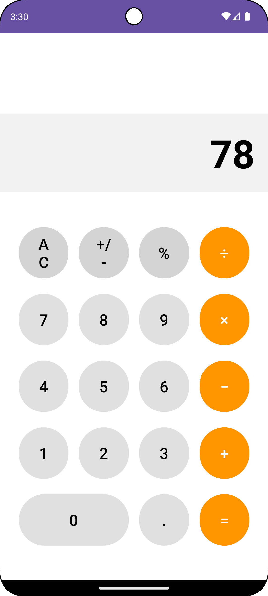

# 📱 Mobil Cihazlarda Uygulama Geliştirme

Android platformu için Kotlin dili kullanılarak geliştirilmiş mobil uygulama projelerim.

---

## 🎯 Projeler

### 1. Öğrenci Kayıt Sistemi


Öğrenci bilgilerini kaydetme, güncelleme ve yönetme uygulaması.

**Özellikler:**
- Öğrenci ekleme, güncelleme ve silme
- Öğrenci listesi görüntüleme
- Arama ve filtreleme
- SQLite veritabanı ile veri saklama

**Teknolojiler:** Android Studio, Kotlin, SQLite

---

### 2. Hesap Makinesi



Temel matematiksel işlemler yapan hesap makinesi uygulaması.

**Özellikler:**
- Dört işlem (Toplama, Çıkarma, Çarpma, Bölme)
- Ondalıklı sayı desteği
- Temizleme ve geri alma fonksiyonları
- Modern ve sezgisel arayüz

**Teknolojiler:** Android Studio, Kotlin

---

## 🛠️ Kullanılan Teknolojiler

- **IDE:** Android Studio
- **Dil:** Kotlin
- **Min SDK:** API 21 (Android 5.0)
- **Target SDK:** API 34 (Android 14)

## 🚀 Kurulum

```bash
# Projeyi klonlayın
git clone https://github.com/Sercansen21/mobil-uygulama-gelistirme.git

# İlgili proje klasörünü Android Studio ile açın
# Gradle sync yapın ve uygulamayı çalıştırın
```

## 👤 Geliştirici

**Sercan Şen**
- GitHub: [@Sercansen21](https://github.com/Sercansen21)
- Email: sen.sercan.21@email.com

---

⭐ Bu projeleri beğendiyseniz yıldız vermeyi unutmayın!