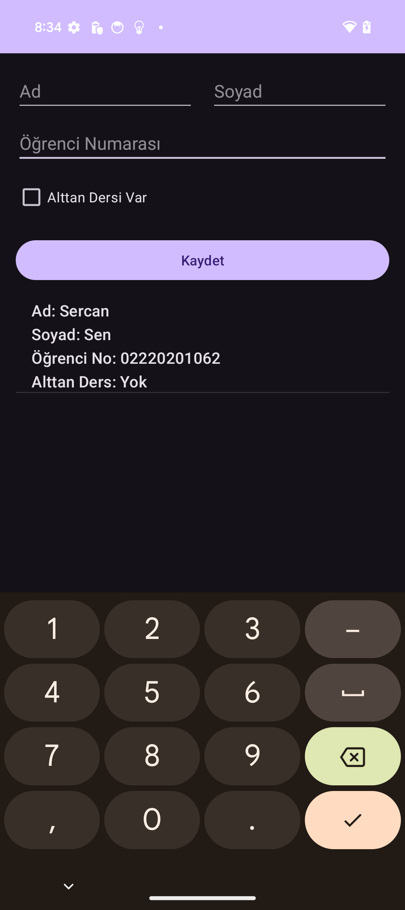
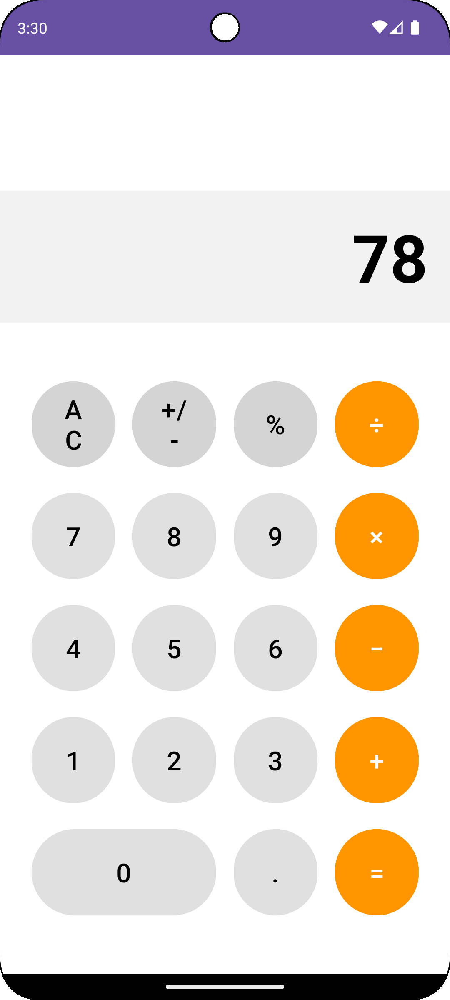

# 📱 Mobil Cihazlarda Uygulama Geliştirme

Android platformu için Kotlin dili kullanılarak geliştirilmiş mobil uygulama projelerim.

---

## 🎯 Projeler

### 1. Öğrenci Kayıt Sistemi



Öğrenci bilgilerini kaydetme, güncelleme ve yönetme uygulaması.

**Özellikler:**
- Öğrenci ekleme, güncelleme ve silme  
- Öğrenci listesi görüntüleme  
- Arama ve filtreleme  
- SQLite veritabanı ile veri saklama  

**Teknolojiler:** Android Studio, Kotlin, SQLite

---

### 2. Hesap Makinesi



Temel matematiksel işlemler yapan hesap makinesi uygulaması.

**Özellikler:**
- Dört işlem (Toplama, Çıkarma, Çarpma, Bölme)  
- Ondalıklı sayı desteği  
- Temizleme ve geri alma fonksiyonları  
- Modern ve sezgisel arayüz  

**Teknolojiler:** Android Studio, Kotlin

---

### 3. Futbolcu Arayüzü


Futbolcuların profil bilgilerini ve istatistiklerini görüntüleme uygulaması.

**Özellikler:**
- Futbolcu fotoğrafı ve kişisel bilgiler  
- Forma numarası, pozisyon, yaş ve takım bilgisi  
- Maç, gol ve asist sayısı istatistikleri  
- Basit ve kullanıcı dostu arayüz  

**Teknolojiler:** Android Studio, Kotlin

---

## 🛠️ Kullanılan Teknolojiler

- **IDE:** Android Studio  
- **Dil:** Kotlin  
- **Min SDK:** API 21 (Android 5.0)  
- **Target SDK:** API 34 (Android 14)

---

## 🚀 Kurulum

```bash
# Projeyi klonlayın
git clone https://github.com/Sercansen21/mobil-uygulama-gelistirme.git

# İlgili proje klasörünü Android Studio ile açın
# Gradle sync yapın ve uygulamayı çalıştırın
